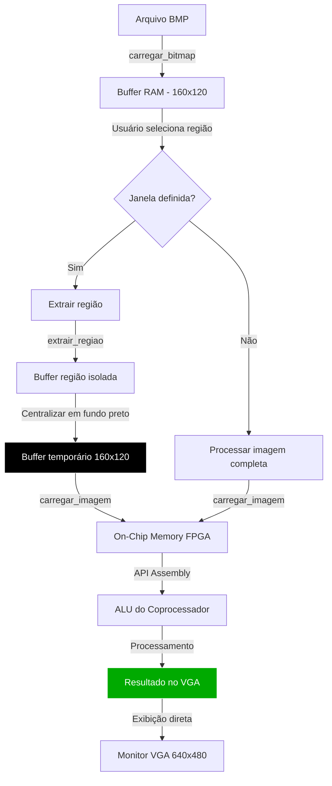

# Aplicação de Controle para Coprocessador de Zoom (DE1-SoC) - Etapa 3

## Descrição do Projeto

Este repositório contém a **Etapa 3** de um projeto de Sistemas Digitais, focado no desenvolvimento de uma **aplicação completa em C** para controle interativo de um coprocessador de redimensionamento de imagens (zoom in/out) implementado em FPGA (DE1-SoC).

A aplicação permite ao usuário carregar imagens BMP, selecionar algoritmos de processamento, definir regiões de interesse com o mouse e aplicar diferentes níveis de zoom, tudo através de uma interface baseada em terminal.

### 🔗 Repositórios das Etapas Anteriores
* **[Etapa 1 - Hardware em Verilog](https://github.com/antoniomedeiross/image_processing_fpga)**
* **[Etapa 2 - Driver em Assembly](https://github.com/antoniomedeiross/zoom-hps-driver)**

---

## Sumário

* [Arquitetura do Sistema](#arquitetura-do-sistema)
* [Funcionalidades](#funcionalidades)
* [Estrutura do Código](#estrutura-do-código)
* [Formato BMP](#formato-bmp)
* [Fluxo de Operação](#fluxo-de-operação)
* [Interface do Usuário](#interface-do-usuário)
* [Compilação e Execução](#compilação-e-execução)
* [Requisitos Atendidos](#requisitos-atendidos)
* [Limitações e Trabalhos Futuros](#limitações-e-trabalhos-futuros)
* [Referências](#referências)

---

## Arquitetura do Sistema

A aplicação em C serve como camada de mais alto nível na arquitetura do projeto, integrando todos os componentes desenvolvidos nas etapas anteriores:

```
┌─────────────────────────────────────────────────────────┐
│                  APLICAÇÃO C (main.c)                   │
│  ┌──────────────┐  ┌──────────────┐  ┌──────────────┐  │
│  │   Interface  │  │  Controle de │  │ Processamento│  │
│  │   Usuário    │  │    Mouse     │  │  de Imagem   │  │
│  └──────────────┘  └──────────────┘  └──────────────┘  │
└─────────────────────────┬───────────────────────────────┘
                          │
                          ▼
┌─────────────────────────────────────────────────────────┐
│              API ASSEMBLY (coprocessador.s)             │
│  ┌──────────────────────────────────────────────────┐   │
│  │  ISA do Coprocessador (9 funções de zoom)       │   │
│  └──────────────────────────────────────────────────┘   │
└─────────────────────────┬───────────────────────────────┘
                          │
                          ▼
┌─────────────────────────────────────────────────────────┐
│           PONTE HPS-FPGA (Memory Mapped I/O)            │
└─────────────────────────┬───────────────────────────────┘
                          │
                          ▼
┌─────────────────────────────────────────────────────────┐
│              COPROCESSADOR FPGA (Verilog)               │
│  ┌──────────┐  ┌──────────┐  ┌──────────────────────┐  │
│  │   ROM    │  │   ALU    │  │    VGA Driver        │  │
│  │ (160x120)│→ │ Algoritmos│→│   (640x480@60Hz)    │  │
│  └──────────┘  └──────────┘  └──────────────────────┘  │
└─────────────────────────────────────────────────────────┘
```

---

## Funcionalidades

### 1. Carregamento de Imagens BMP
- ✅ Suporta arquivos BMP de **8 bits (escala de cinza)** e **24 bits (RGB)**
- ✅ Conversão automática de RGB para escala de cinza
- ✅ Validação de formato e dimensões (160x120 pixels)
- ✅ Tratamento de padding e ordem invertida (bottom-up)
- ✅ Carregamento dinâmico durante execução (tecla `L`)

### 2. Seleção de Região com Mouse
- ✅ Interface visual com cursor em forma de cruz
- ✅ Seleção de dois cantos opostos via clique do mouse
- ✅ Feedback visual com retângulo de seleção
- ✅ Animação do primeiro canto durante seleção
- ✅ Exibição em tempo real das coordenadas (x, y)

### 3. Algoritmos de Zoom
Três algoritmos implementados, cada um com características específicas:

| Algoritmo | Zoom In | Zoom Out | Características |
|-----------|---------|----------|-----------------|
| **Vizinho Mais Próximo** | 2x, 4x | 0.5x, 0.25x | Universal, funciona em todos os modos |
| **Replicação** | 2x, 4x | ❌ | Otimizado para ampliação |
| **Média de Blocos** | ❌ | 0.5x, 0.25x | Suavização na redução |

### 4. Controles Interativos
- ✅ **[+]** - Aumentar zoom (1x → 2x → 4x)
- ✅ **[-]** - Diminuir zoom (4x → 2x → 1x → 0.5x → 0.25x)
- ✅ **[1]** - Algoritmo: Vizinho Mais Próximo
- ✅ **[2]** - Algoritmo: Replicação
- ✅ **[3]** - Algoritmo: Média de Blocos
- ✅ **[L]** - Carregar nova imagem
- ✅ **[R]** - Resetar janela de seleção
- ✅ **[Q]** - Sair

### 5. Validação de Compatibilidade
O sistema verifica automaticamente a compatibilidade entre algoritmo e nível de zoom:
- Bloqueia zoom incompatível com avisos ao usuário
- Ajusta automaticamente quando necessário
- Impede combinações inválidas (ex: Média + 2x)

---

## Estrutura do Código

### Arquivos Principais

#### 1. `main.c` - Aplicação Principal
Componentes principais:

```c
/* Estruturas de Dados */
typedef struct {
    int x1, y1, x2, y2;      // Coordenadas da janela
    int ativo;                // Status da janela
    int pontos_definidos;     // Contador de cliques
} JanelaZoom;

typedef struct {
    unsigned char *imagem_original;
    unsigned char *imagem_atual;
    JanelaZoom janela;
    TipoAlgoritmo algoritmo;
    float nivel_zoom;
    int mouse_x, mouse_y;
} EstadoApp;
```

**Funções de Desenho:**
- `desenhar_cursor()` - Cruz com borda para visibilidade
- `desenhar_retangulo()` - Marca visual da região selecionada
- `desenhar_cantos_animados()` - Feedback durante seleção

**Funções de Processamento:**
- `extrair_regiao()` - Isola área de interesse
- `sobrepor_regiao()` - Compõe resultado sobre original
- `processar_com_algoritmo()` - Orquestra todo o pipeline

#### 2. `bitmap.c` - Manipulação de BMP
```c
int carregar_bitmap(const char *nome_arquivo, 
                   unsigned char *buffer,
                   int largura_esperada, 
                   int altura_esperada);

int salvar_bitmap(const char *nome_arquivo,
                 unsigned char *buffer,
                 int largura, int altura);
```

#### 3. `coprocessador.h` - Interface da API
```c
/* Inicialização e Finalização */
void iniciar_coprocessador(void);
void encerrar_coprocessador(void);

/* Transferência de Dados */
void carregar_imagem(unsigned char *buffer, int tamanho);
void limpar_imagem(void);

/* ISA do Coprocessador */
void api_bypass(void);           // 1x
void api_vizinho_2x(void);       // Zoom in 2x
void api_vizinho_4x(void);       // Zoom in 4x
void api_vizinho_0_5x(void);     // Zoom out 0.5x
void api_vizinho_0_25x(void);    // Zoom out 0.25x
void api_replicacao_2x(void);    // Replicação 2x
void api_replicacao_4x(void);    // Replicação 4x
void api_media_0_5x(void);       // Média 0.5x
void api_media_0_25x(void);      // Média 0.25x
```

---

## Formato BMP

### Estrutura de um Arquivo BMP

```
┌─────────────────────────────────────┐
│  1. BMP HEADER (14 bytes)           │ ← Identificação do arquivo
├─────────────────────────────────────┤
│  2. INFO HEADER (40 bytes)          │ ← Dimensões e formato
├─────────────────────────────────────┤
│  3. PALETA DE CORES (256×4 bytes)   │ ← Opcional (8-bit)
├─────────────────────────────────────┤
│  4. DADOS DOS PIXELS                │ ← Imagem (bottom-up)
└─────────────────────────────────────┘
```

### Headers do BMP

#### BMP Header (14 bytes)
```c
typedef struct {
    uint16_t tipo;        // 0x4D42 = "BM"
    uint32_t tamanho;     // Tamanho total do arquivo
    uint16_t reservado1;  // 0
    uint16_t reservado2;  // 0
    uint32_t offset;      // Posição dos dados de pixel
} BMPHeader;
```

#### Info Header (40 bytes)
```c
typedef struct {
    uint32_t tamanho;           // 40 bytes
    int32_t  largura;           // Largura em pixels
    int32_t  altura;            // Altura (+ = bottom-up)
    uint16_t planos;            // Sempre 1
    uint16_t bits_por_pixel;    // 8 ou 24
    uint32_t compressao;        // 0 = sem compressão
    uint32_t tamanho_imagem;
    // ... outros campos
} BMPInfoHeader;
```

### Processamento de Pixels

#### 1. Padding
BMPs requerem que cada linha seja múltiplo de 4 bytes:
```c
int padding = (4 - (largura_bytes % 4)) % 4;
```

**Exemplo:** Imagem 160x120, 8 bits/pixel
- 160 bytes por linha
- 160 % 4 = 0 → **Sem padding necessário**

#### 2. Ordem Invertida
BMPs armazenam pixels de baixo para cima:
```c
for (y = 0; y < altura; y++) {
    int linha_destino = (altura - 1 - y);  // Inverte
    fread(linha, 1, largura + padding, arquivo);
    memcpy(&buffer[linha_destino * largura], linha, largura);
}
```

#### 3. Conversão RGB → Escala de Cinza
Para imagens de 24 bits:
```c
// Fórmula ITU-R BT.601 (ponderada pela sensibilidade humana)
unsigned char gray = (unsigned char)(
    0.299 * r +  // Red (30%)
    0.587 * g +  // Green (59%) - maior peso
    0.114 * b    // Blue (11%)
);
```

### Acesso Matricial

Transformação de coordenadas 2D para índice linear:
```c
// Pixel na posição (x, y)
unsigned char pixel = buffer[y * IMG_WIDTH + x];

// Exemplo: pixel (50, 30) em imagem 160x120
int index = 30 * 160 + 50 = 4850;
```

---

## Fluxo de Operação

### Pipeline Completo de Processamento



### Detalhamento do Processamento de Região

Quando o usuário seleciona uma janela e aplica zoom:

1. **Extração da Região**
```c
extrair_regiao(imagem_original, regiao_extraida,
               janela.x1, janela.y1, 
               janela.x2, janela.y2);
```

2. **Centralização no Buffer (com fundo preto)**
```c
// Criar buffer temporário preenchido com preto
memset(buffer_temporario, 0, IMG_SIZE);

// Calcular posição para centralizar a região
int offset_x = (160 - largura_janela) / 2;
int offset_y = (120 - altura_janela) / 2;

// Colocar região no centro, resto permanece preto
sobrepor_regiao(buffer_temporario, regiao_extraida,
                offset_x, offset_y,
                largura_janela, altura_janela);
```

3. **Processamento na FPGA**
```c
// Enviar buffer (região centralizada + preto) para FPGA
carregar_imagem(buffer_temporario, 19200);

// Aplicar algoritmo de zoom selecionado
api_vizinho_2x();  // Exemplo: zoom 2x
```

4. **Exibição Direta**
```c
// O resultado processado é exibido diretamente pela FPGA no VGA
// A região ampliada aparece centralizada em um fundo preto
```

**Observação:** Esta abordagem simplifica o pipeline ao exibir apenas a região processada (centralizada em preto) sem composição sobre a imagem original. Isso facilita a visualização isolada da área de interesse.

---

## Interface do Usuário

### Tela Principal

```
╔═══════════════════════════════════════════════════════╗
║     SISTEMA DE PROCESSAMENTO DE IMAGENS - ETAPA 3     ║
╚═══════════════════════════════════════════════════════╝

Posição do Mouse: (80, 60)
Zoom Atual: 2.00x
Algoritmo Selecionado: Vizinho Mais Próximo

Janela de Zoom:
   └─ Região: (20,15) até (100,80)
   └─ Status: ATIVA ✓

╔═══════════════════════════════════════════════════════╗
║ CONTROLES                                             ║
╠═══════════════════════════════════════════════════════╣
║ [Clique Esquerdo]  → Definir cantos da janela        ║
║ [+]                → Zoom In                          ║
║ [-]                → Zoom Out                         ║
║ [1]                → Algoritmo: Vizinho Mais Próximo  ║
║ [2]                → Algoritmo: Replicação            ║
║ [3]                → Algoritmo: Média de Blocos       ║
║ [L]                → Carregar nova imagem BMP         ║
║ [R]                → Resetar janela                   ║
║ [Q]                → Sair                             ║
╚═══════════════════════════════════════════════════════╝
```

### Feedback Visual

#### Cursor do Mouse
```
    |       ← Linha vertical
────┼────   ← Linha horizontal (cruz)
    |
```
- Cor branca com borda preta para visibilidade
- Tamanho configurável (`CURSOR_SIZE = 5`)

#### Retângulo de Seleção
```
╔═══════════════╗
║               ║  ← Espessura: 2 pixels
║   REGIÃO      ║
║  SELECIONADA  ║
╚═══════════════╝
```

#### Animação do Primeiro Canto
```
Ciclo 1:  └─      (pequeno)
Ciclo 2:  └──     (médio)
Ciclo 3:  └───    (grande)
Ciclo 4:  └──     (médio)
```

---

## Compilação e Execução

### Pré-requisitos

1. **Hardware:**
   - Placa DE1-SoC com Linux embarcado
   - Monitor VGA conectado
   - Mouse USB conectado

2. **Software:**
   - GCC ARM cross-compiler ou nativo
   - GNU Make
   - Arquivo BMP de teste (160x120, 8-bit)

### Estrutura de Arquivos

```
projeto/
├── main.c              # Aplicação principal
├── bitmap.c            # Manipulação de BMP
├── bitmap.h            # Header do bitmap
├── coprocessador.s     # API Assembly (Etapa 2)
├── coprocessador.h     # Interface da API
├── Makefile            # Script de compilação
└── imagem_teste.bmp    # Imagem de exemplo
```

### Compilação

```bash
# Método 1: Usando Makefile
make

# Método 2: Compilação manual
arm-linux-gnueabihf-gcc -o zoom_app \
    main.c bitmap.c coprocessador.s \
    -O2 -march=armv7-a -mfpu=neon \
    -Wall -Wextra
```

### Execução

```bash
# Na placa DE1-SoC
sudo ./zoom_app imagem_teste.bmp

# Motivo do sudo: necessário para acessar /dev/input/event0 (mouse)
```

### Configuração do Mouse

Se o mouse não funcionar, identifique o dispositivo correto:

```bash
# Listar dispositivos de entrada
ls -l /dev/input/

# Testar eventos
sudo cat /dev/input/event0

# Dar permissões (alternativa ao sudo)
sudo chmod 666 /dev/input/event*
```

---

## Requisitos Atendidos

### Etapa 2 (API Assembly)
- ✅ Código da API escrito em Assembly
- ✅ Utiliza apenas componentes da placa
- ✅ Implementa comandos da ISA do coprocessador
- ✅ Imagens em escala de cinza (8 bits)
- ✅ Leitura de arquivo e transferência para coprocessador
- ✅ Compatibilidade com ARM HPS

### Etapa 3 (Aplicação C)
- ✅ Código em linguagem C
- ✅ Driver ligado via header (`coprocessador.h`)
- ✅ Operações implementadas:
  - ✅ 3.1. Carregar arquivo bitmap
  - ✅ 3.2. Selecionar algoritmo de zoom
  - ✅ 4.1. Janela processada exibida (centralizada em fundo preto)
  - ✅ 4.2. Posição (x,y) do mouse visualizada
  - ✅ 4.3. Mouse define dois cantos opostos
  - ✅ 4.4. Seleção por clique do mouse
  - ✅ 4.5. Zoom in/out na janela selecionada
  - ✅ 4.6. Tecla + para zoom in
  - ✅ 4.7. Tecla - para zoom out

**Nota sobre o requisito 4.1:** A janela ampliada é exibida centralizada em um fundo preto, isolando a região de interesse. Esta abordagem simplifica a visualização e facilita a análise da área processada.

---

## Limitações e Trabalhos Futuros

### Decisões de Design

1. **Exibição da Região Processada** ℹ️
   - **Abordagem atual:** Região processada é exibida centralizada em fundo preto
   - **Vantagem:** Visualização isolada facilita análise da área de interesse
   - **Alternativa não implementada:** Composição sobre imagem original
   - **Justificativa:** Simplifica o pipeline e evita necessidade de recuperar dados da FPGA

2. **Restrição de Seleção de Janela**
   - Janela só pode ser selecionada em modo 1x (bypass)
   - Zoom aplicado apenas após seleção completa
   - *Justificativa:* Simplifica lógica de coordenadas e evita confusão visual

3. **Compatibilidade de Algoritmos**
   - Média: apenas zoom out (0.5x, 0.25x)
   - Replicação: apenas zoom in (2x, 4x)
   - *Solução:* Sistema valida e avisa o usuário

### Melhorias Futuras

#### Alta Prioridade
- [ ] Implementar composição sobre imagem original (opcional)
- [ ] Adicionar suporte para múltiplas janelas simultâneas
- [ ] Permitir redimensionamento da janela após seleção

#### Média Prioridade
- [ ] Salvar resultado processado em arquivo BMP
- [ ] Histórico de operações (undo/redo)
- [ ] Pré-visualização em miniatura
- [ ] Suporte para imagens coloridas (RGB)

#### Baixa Prioridade
- [ ] Interface gráfica (GUI) com framebuffer
- [ ] Zoom contínuo (não apenas níveis discretos)
- [ ] Filtros adicionais (blur, sharpen, edge detection)
- [ ] Benchmark de desempenho de cada algoritmo

---

## Exemplo de Uso Completo

### Cenário: Ampliar Rosto em Foto de Grupo

```bash
# 1. Iniciar aplicação
sudo ./zoom_app foto_grupo.bmp

# 2. No terminal, aparece:
# "Posição do Mouse: (0, 0)"
# "Zoom Atual: 1.00x"

# 3. Mover mouse até canto superior esquerdo do rosto
# Terminal atualiza: "Mouse: (45, 30)"

# 4. Clicar botão esquerdo
# Terminal: "✓ Primeiro canto definido: (45, 30)"

# 5. Mover mouse até canto inferior direito
# Terminal: "Mouse: (85, 70)"

# 6. Clicar botão esquerdo novamente
# Terminal: "✓ Segundo canto definido: (85, 70)"
# Terminal: "✓ Janela ativada!"

# 7. Pressionar [2] para selecionar Replicação
# Terminal: "Algoritmo alterado: Replicação"

# 8. Pressionar [+] para zoom 2x
# Terminal: "[PROCESSAMENTO] Aplicando zoom 2.00x"
# Terminal: "na região (45,30) até (85,70) [40x40]"
# Terminal: "Algoritmo: Replicação 2X (região)"
# Terminal: "[OK] Processamento concluído!"

# 9. VGA mostra: região ampliada centralizada em fundo preto

# 10. Pressionar [+] novamente para zoom 4x
# Terminal: "Aplicando zoom 4.00x"
# VGA: rosto ainda mais ampliado (isolado)

# 11. Pressionar [-] para voltar a 2x
# 12. Pressionar [R] para resetar e processar imagem completa
# 13. Pressionar [Q] para sair
```

---

## Resolução de Problemas

### Mouse não responde
```bash
# Verificar permissões
ls -l /dev/input/event0
# Se: crw------- → sem permissão

# Solução 1: rodar com sudo
sudo ./zoom_app imagem.bmp

# Solução 2: adicionar permissões
sudo chmod 666 /dev/input/event*
```

### Imagem não carrega
```bash
# Verificar formato
file imagem.bmp
# Deve ser: PC bitmap, Windows 3.x format, 160 x 120 x 8

# Converter se necessário (no PC, antes de transferir)
convert imagem.png -resize 160x120! -type Grayscale BMP3:imagem.bmp
```

### Erro "Falha ao alocar memória"
```bash
# Verificar memória disponível
free -h

# Se RAM baixa, fechar outros processos
killall -9 processo_pesado
```

### VGA não exibe nada
```bash
# Verificar se coprocessador foi inicializado
dmesg | grep fpga

# Verificar mapeamento de memória
cat /proc/iomem | grep ff200000
```

---

## Referências

### Documentação Técnica
- [DE1-SoC User Manual](https://www.terasic.com.tw/cgi-bin/page/archive_download.pl?Language=English&No=836&FID=cd9c7dc7f2e7e3d4d59b4441ff49129)
- [BMP File Format Specification](https://en.wikipedia.org/wiki/BMP_file_format)
- [Linux Input Subsystem](https://www.kernel.org/doc/html/latest/input/input.html)
- [ARM Cortex-A9 Technical Reference Manual](https://developer.arm.com/documentation/ddi0388/latest/)

### Tutoriais e Exemplos
- [FPGA Academy - DE1-SoC Computer](https://www.fpgaacademy.org/boards.html)
- [Image Processing on FPGA using Verilog](https://www.fpga4student.com/2016/11/image-processing-on-fpga-verilog.html)
- [Linux Device Drivers - Input Drivers](https://www.kernel.org/doc/html/latest/input/input-programming.html)

### Bibliotecas de Processamento de Imagens (Referência)
- [OpenCV](https://opencv.org/) - Comparação de algoritmos
- [ImageMagick](https://imagemagick.org/) - Conversão de formatos

### Projetos Relacionados
- [OpenCores - Image Processing](https://opencores.org/projects?category=Image%20processing)
- [FPGA Image Processing Examples](https://github.com/topics/fpga-image-processing)

> **Nota:** Estas referências foram consultadas como base teórica e inspiração. O código desenvolvido é original e adaptado aos requisitos específicos do projeto.

---

## Licença

Este projeto foi desenvolvido como parte da disciplina de Sistemas Digitais da Universidade Estadual de Feira de Santana (UEFS).

---

## Autores

* **Equipe:** [Antonio Medeiros, Allany Victória, Allison Wilker]
* **Professor:** [Wild Freitas]
* **Semestre:** 2025.2

---

**Última atualização:** Novembro de 2025
